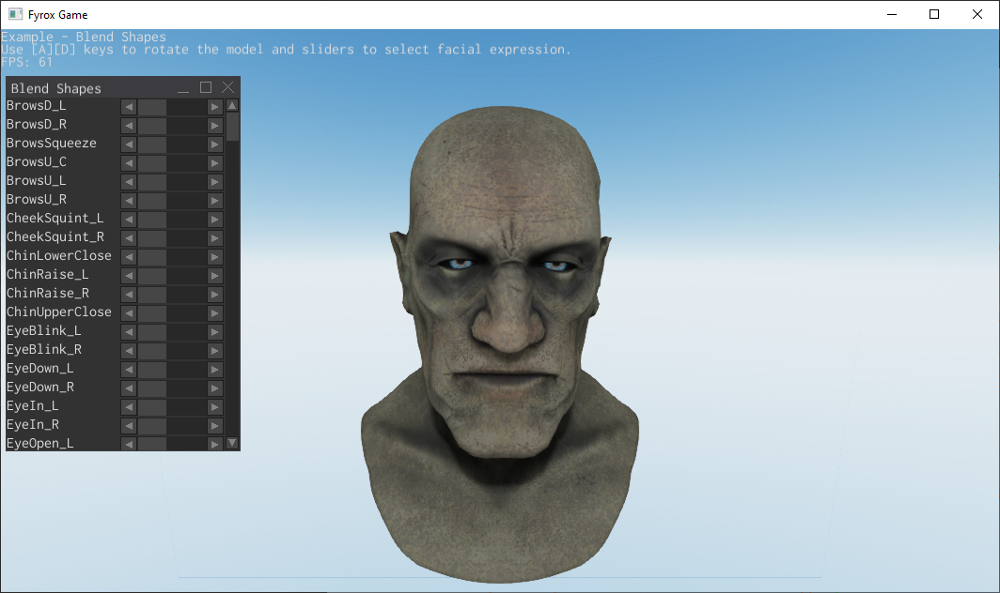

## Blend shapes

This project shows how to use blend shapes to create facial expressions for your game characters. Use the set of sliders
to control each blend shape's weight.

### How to run

- The game: `cargo run --package executor --release`
- The editor: `cargo run --package editor --release`